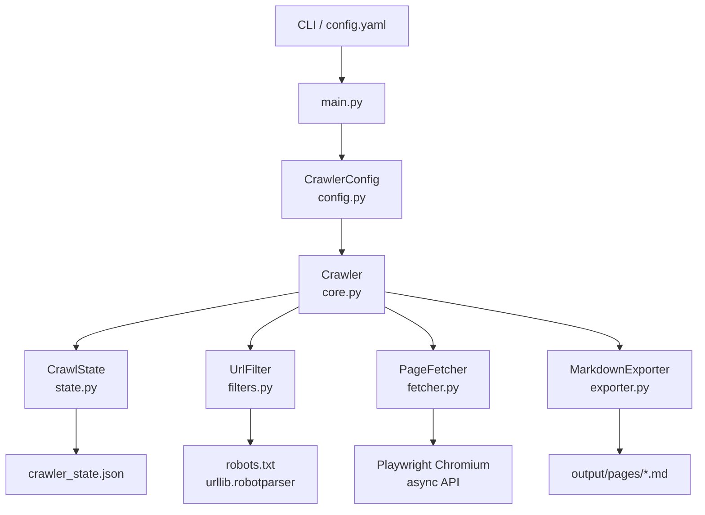
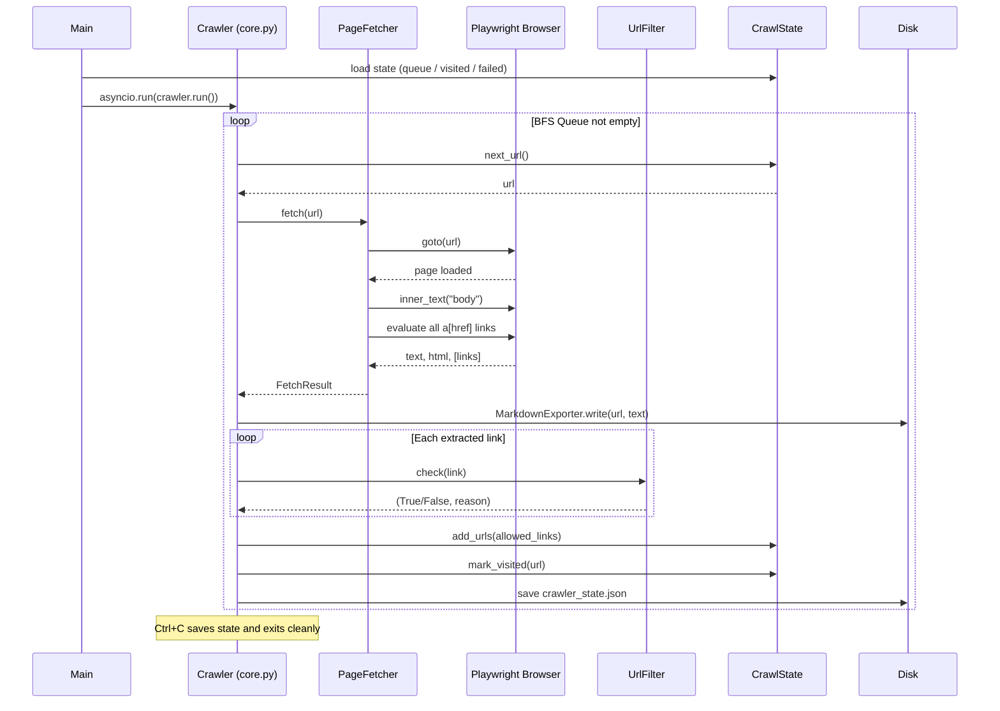

# Site Crawler

An async BFS web crawler that archives website pages as Markdown files.

Built with Python `asyncio` and Playwright. Configurable via YAML, with full
CLI override support and Docker deployment.

## Features

- Async BFS crawl with persistent queue and resume support
- Page content exported to Markdown
- YAML-based configuration with CLI overrides
- Generic URL filtering via regex patterns (no site-specific logic)
- Optional `robots.txt` enforcement
- Retry with exponential backoff for transient failures
- Docker ready

## Architecture



## Data Flow



## Project Structure

```
site-crawler/
├── crawler/
│   ├── config.py      # YAML loader + dataclasses
│   ├── filters.py     # URL filter (domain, extension, regex, robots)
│   ├── state.py       # Async BFS state with JSON persistence
│   ├── fetcher.py     # Playwright async page fetcher
│   ├── exporter.py    # Markdown file writer
│   └── core.py        # Main async crawl loop
├── tests/
│   ├── test_filters.py
│   ├── test_state.py
│   └── test_exporter.py
├── main.py            # CLI entry point
├── config.yaml        # Default configuration
├── Dockerfile
├── docker-compose.yml
└── requirements.txt
```

## Setup

```bash
python -m venv .venv

# Windows
.venv\Scripts\pip install -r requirements.txt
.venv\Scripts\playwright install chromium

# macOS / Linux
.venv/bin/pip install -r requirements.txt
.venv/bin/playwright install chromium
```

## Configuration

Edit `config.yaml` before running:

```yaml
crawler:
  start_url: "https://example.com"
  allowed_domain: "example.com"
  max_pages: null          # null = unlimited

delays:
  min: 1.0
  max: 3.0

filters:
  respect_robots: true
  exclude_patterns: []     # regex — any match blocks the URL
  include_patterns: []     # regex whitelist — empty means allow all
```

## Usage

```bash
# Use config.yaml defaults
python main.py

# Override start URL and domain
python main.py --url https://example.com --domain example.com

# Limit to 100 pages
python main.py --max-pages 100

# Add exclude patterns at runtime
python main.py --exclude "/login/" "/admin/" "/cart/"

# Show browser window
python main.py --headless false

# Ignore robots.txt
python main.py --ignore-robots

# Clear state and restart
python main.py --reset
```

Press `Ctrl+C` at any time — state is saved and the crawl resumes on the next run.

## CLI Reference

| Flag              | Default        | Description                              |
|-------------------|----------------|------------------------------------------|
| `--config`        | `config.yaml`  | YAML config file path                    |
| `--url`           | from config    | Override start URL                       |
| `--domain`        | from config    | Override allowed domain                  |
| `--max-pages`     | null           | Stop after N pages                       |
| `--min-delay`     | from config    | Min delay between requests (s)           |
| `--max-delay`     | from config    | Max delay between requests (s)           |
| `--headless`      | `true`         | Pass `false` to show browser             |
| `--exclude`       | —              | Additional regex exclude patterns        |
| `--ignore-robots` | false          | Ignore robots.txt                        |
| `--reset`         | false          | Clear state and restart                  |

## URL Filtering

`UrlFilter` evaluates links in this order:

1. **Invalid** — non-HTTP/HTTPS URLs or empty strings are rejected immediately
2. **Domain** — only URLs matching `allowed_domain` (www. normalised) are followed
3. **Extension** — configurable blocklist (`.jpg`, `.pdf`, `.zip`, etc.)
4. **Exclude patterns** — any URL matching a regex in `exclude_patterns` is blocked
5. **Include patterns** — if `include_patterns` is non-empty, URL must match at least one
6. **robots.txt** — fetched once per domain and cached; checked if `respect_robots: true`

## Error Handling

| Error type           | Behaviour                                           |
|----------------------|-----------------------------------------------------|
| HTTP 429             | Long backoff (4× base delay), then re-queued        |
| Playwright timeout   | Retry with exponential backoff (up to max_retries)  |
| Any other exception  | Permanently failed — logged, not retried            |

## Docker

```bash
# Build
docker build -t site-crawler .

# Run (edit config.yaml first)
docker run -v $(pwd)/output:/app/output -v $(pwd)/config.yaml:/app/config.yaml site-crawler

# Or with docker-compose
docker compose up
```

## Output

```
output/
  pages/
    about_a1b2c3d4.md
    products_e5f6g7h8.md
    ...
crawler_state.json    # resume state
crawler.log           # full debug log
```

Each Markdown file has the format:

```markdown
# https://example.com/about

<full page body text>
```

## Log Diagnostics

Each crawled page logs link filtering stats:

```
Links: total=134 allowed=22 reasons={'allowed': 22, 'robots': 80, 'domain': 32}
```

Use this to diagnose why links are being filtered out.

## Tests

```bash
pytest tests/ -v
```

All tests run without a real browser or network.

## Tech Stack

- [Playwright](https://playwright.dev/python/) — async browser automation
- [PyYAML](https://pyyaml.org/) — YAML config parsing
- [pytest](https://pytest.org/) — unit tests

## Disclaimer

For educational and research use only. Always respect a website's terms of service
and applicable laws before crawling.